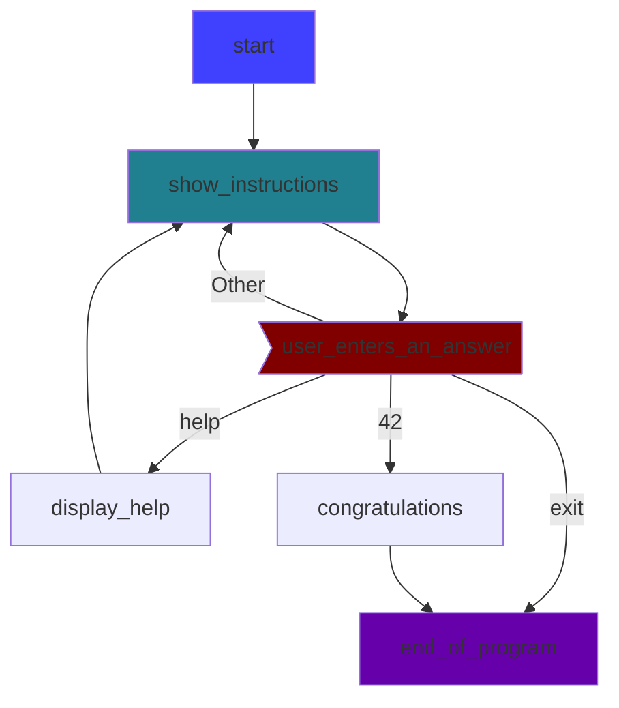
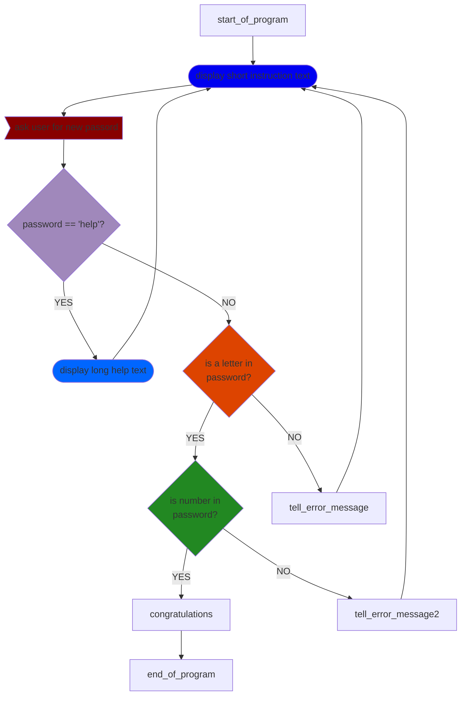

# Quizfragen 

## Aufgaben für das Kapitel _Basic_:

### Aufgabe basic 1

* Erstelle eine Variable mit dem Namen `sentence` und weise ihr den Wert eines Strings mit elf Wörtern zu (beliebige Wörter).
* Gib (den Wert der Variable) `sentence` aus.
* Füge diese Codezeile am Ende deines Programms hinzu:
```python
print(len(sentence.split()))
```

Hinweis: Die Python-`split()`-Funktion zählt die Wörter in einem String, indem sie die Leerzeichen zwischen den Wörtern zählt, daher lautet die genaue Aufgabe: „Schreibe 11 Wörter mit 10 Leerzeichen zwischen ihnen“.

**mögliche Lösung**:

<details> <summary>Klicken zum Ausklappen</summary>

```python
# solution for basic 1
sentence = "Fischers Fritz fischt frische Fische. Frische Fische fischt Fischer's Fritz."
print(sentence)
print(len(sentence.split()))
```

</details>


### Aufgabe basic 2

* Erstelle eine Variable mit dem Namen `gedicht` und weise ihr einen String mit einigen Wörtern zu.
* Der String soll über drei Textzeilen gehen.
* Gib den Wert der Variable poem aus.
* Füge diese Codezeile am Ende deines Programms hinzu:
```python
print(len(gedicht.splitlines()))
```

Können Sie diese Aufgabe (dass der String über mehrere Zeilen geht) auf verschiedene Arten lösen?

**mögliche Lösungen**:

<details>
<summary>Klicken zum Ausklappen</summary>

#### Variante A

```python
# solution for chapter basic,  task 2, variant A
gedicht = """Eins
Zwo
g'suffa!"""
print(gedicht)
print(len(gedicht.splitlines()))
```

#### Variante B

```python
# solution for chapter basic,  task 2, variant B
gedicht='Eins\nZwo\ng'suffa!'
print(gedicht)
print(len(gedicht.splitlines()))
```

#### Variante C

```python
# solution for chapter basic,  task 2, variant C
poem="\n".join(["Eins","Zwo","g'suffa!"])
print(poem)
print(len(gedicht.splitlines()))
```

</details>


### Aufgabe basic 3
Erstelle eine Variable mit dem Namen `gehalt` und weise ihr den Wert `4000` zu.
Gib den Wert von `salary` aus.

**mögliche Lösungen**:

<details> <summary>Klicken zum Ausklappen</summary>

#### Variante A

```python
# solution for chapter basic,  task 3, variant A
# most common variant
gehalt = 4000
print(gehalt)
```

#### Variante B

```python
# solution for chapter basic,  task 3, variant B
# use underscores for better readability
gehalt = 4_000
print(gehalt)
```

#### Variante C

```python
# solution for chapter basic, task 3, variant C
print(gehalt:=4000) # walrus operator, 
# siehe <https://peps.python.org/pep-0572/>
```

</details>


###  Aufgabe basic 4 

* Erstelle eine Variable mit dem Namen `gehalt` und weise ihr den Wert `4000` zu.
* Erstelle eine Variable namens `output`. Der Wert von `output` soll dieser String sein: `"Mein Gehalt ist X Euro pro Monat"`.
* Modifiziere den Code so, dass Python `X` durch den Wert der Variable `gehalt` ersetzt.
* Gib den Wert von `gehalt` aus.

Können Sie diese Aufgabe auf verschiedene Arten lösen?

**mögliche Lösungen**:


<details>
<summary>Klicken zum Ausklappen</summary>

#### Variante A

```python
# solution for chapter basic,  task 4, variant A
# using .format()
gehalt=4000
output = 'Mein Gehalt ist {} Euro pro Monat'.format(gehalt)
print(output)
```

#### Variante B

```python
# solution for chapter basic,  task 4, variant B
# using f-strings
gehalt = 4_000 # Unterstriche verbessern die Lesbarkeit
output = f'Mein Gehalt ist {gehalt} Euro pro Monat'
print(output)
```

#### Variante C

```python
# solution for chapter basic,  task 4, variant C
# using str()
gehalt=4000
output = "Mein Gehalt ist " + str(gehalt) + " Euro pro Monat"
print(output)
```

#### Variante D

```python
# solution for chapter basic,  task 4, variant D
# using %
gehalt=4000
output = 'Mein Gehalt ist %i Euro pro Monat' % income
print(output)
```

</details>


### Aufgabe basic 5

**Bezeichner für Variablen**

-Welche dieser Namen sind gültige Bezeichner (namen) für Variablen in Python?


1) `a`
2) `A`
3) `aaaa`
4) `a123`
5) `123a`
6) `_123a`
7) `_a123`
8) `a_123`
9) `1_a23`
10) `!abc`
11) `a-b`
12) `a_minus_b`

**Korrekte Antworten**:

<details> <summary>Klicken zum Ausklappen</summary>

1, 2, 3, 4, 6, 7, 8, 12

</details>

## Aufgaben für das Kapitel _Operatoren und Ausdrücke_

### Aufgabe op_exp 1

- Welche dieser Python-Ausdrücke ergeben den Wert True?


1. `True == False`
2. `True == True`
3. `False == False`
4. `5 > 2`
5. `len("Michael") > len("Mike")`
6. `5 != 7`
7. `6 >= 6`
8. `"abc" * 3 == "abcabcabc"`
9. `5**2 == 25`
10. `0 == False`
11. `1 == True`
12. `2 == True`
13. `2 == False`
14. `True == 1`
15. `None == None`
16. `None != 0`
17. `None == ""`


**Korrekte Antworten**:

<details> <summary>Klicken zum Ausklappen</summary>

2,3,4,5,6,7,8,9,10,11,14,15,16

</details>

### Aufgabe op_exp 2

Welche der folgenden Python-Ausdrücke ergeben den Wert False?

1. `10 / 5 == 2.0`
2. `10 // 5 == 2`
3. `10 % 3 == 1`
4. `( 5 > 1) und ( 5 > 7)`
5. `( 5 > 1) oder (5 > 7)`
6. `not (5 > 7)`

**Korrekte Antwort(en)**:

<details> <summary>Klicken zum Ausklappen</summary>

4

</details>

### Aufgabe op_exp 3

Was wird die Ausgabe (der Wert der Variable `x`) dieses Python-Programms sein?


```python
x = 5
x = 5+1
x += 1
x = x * 2
x /= 2
print(x)
```

**Korrekte Antwort**:

<details> <summary>Klicken zum Ausklappen</summary>

7.0

</details>

## Aufgaben für das Kapitel Kontrollfluss 


### Aufgabe control_flow 1

In den Aufgaben für dieses Kapitel verwende (einige der) Python-Anweisungen, die im Kapitel [Kontrollfluss](./control_flow_de.md) beschrieben sind (wie `if`, `elif`, `else`, `for`, `while`, `continue`, `break`).

- Schreibe ein Programm, das den Benutzer ein Passwort eingeben lässt und eine Antwort über das Passwort gibt:
- Wenn das Passwort SeCrEt ist, soll das Programm `Correct` ausgeben und beenden.
- Wenn der Benutzer ein falsches Passwort eingibt, soll das Programm `Wrong` ausgeben und erneut nach einem Passwort fragen.
- Nach 3 fehlgeschlagenen Versuchen soll das Programm `You failed 3 times` ausgeben und beenden.
- Bevor das Programm endet, soll es `bye!` ausgeben.

Beispielausgabe:

```
Please enter password: >>>secret
Wrong
Please enter password: >>>Secret
Wrong
Please enter password: >>>SeCrEt
Correct
bye!
```

**mögliche Lösungen**:

<details> <summary>Klicken zum Ausklappen</summary>

#### Variante A

```python
# solution for chapter control flow,  task 1, variant A
for a in range(3):
    text = input("Please enter password: >>>")
    if text == "SeCrEt":
        print("Correct")
        break
    else:   
        print("Wrong")
else:
    print("You failed 3 times")
print("bye!")
```

#### Variante B

```python 
# solution for chapter control flow,  task 1, variant B
for _ in range(3):
    if input("Please enter password: >>>") == "SeCrEt":
        print("Correct")
        break
    print("Wrong")
else:
    print("You failed 3 times")
print("bye!")
```

#### Variante C

```python
# solution for chapter control flow,  task 1, variant C
attempt = 1
max_attempts = 3
valid_password = "SeCrEt"
while True:
    print(f"this is attempt {attempt} of {max_attempts}")
    text = input("Please enter password: >>>")
    if text == valid_password:
        print("Correct")
        break
    else:
        print("Wrong")
    attempt += 1
    if attempt > 3:
        print("You failed 3 times")
        break
print("bye!")
```

#### Variante D

```python
# solution for chapter control flow,  task 1, variant D
attempt = 0
while attempt < 3:
    attempt += 1
    if input("Please enter password: >>>") == "SeCrEt":
        print("Correct")
        break
    print("Wrong")
else:
    print("You failed 3 times")
print("bye!")
```

#### Variante E

```python
# solution for chapter control flow,  task 1, variant E
attempt = 1
while input("Please enter password: >>>") != "SeCrEt":
    print("wrong")
    attempt += 1
    if attempt > 3:
        print("You failed 3 times")
        break
else:
    print("correct")
print("bye!")
```

</details>

### Aufgabe control_flow 2

Das folgende Programm funktioniert **nicht** wie beabsichtigt.

Was das Programm eigentlich tun sollte:

- Das Programm soll den Benutzer ein Passwort eingeben lassen.
- Wenn der Benutzer das richtige Passwort (secret) eingibt, soll das Programm correct ausgeben und beenden.
- Wenn der Benutzer ein falsches Passwort eingibt, soll das Programm erneut fragen.
- Wenn der Benutzer 3-mal ein falsches Passwort eingibt, soll das Programm `You failed 3 times` ausgeben und beenden.

Deine Aufgaben nach der Analyse des Programms:

- Finde heraus, warum dieses Programm nicht wie beabsichtigt funktioniert.
- Schlage vor, wie man das Programm ändern kann, damit es wie gewünscht funktioniert.


Hier der Quellcode des nicht funktionierenden Programms:

```python
# problem  control flow,  task 2, 
password = "secret"
max_attempts = 3
attempt = 1
while attempt < max_attempts:
    print(f"Attempt {attempt} of {max_attempts}")
    guess = input("enter password: >>>")
    if guess == password:
        print("correct")
        break
    attempt += 1
else:
    print("You failed 3 times")
print("bye")
```

**mögliche Lösung**:

<details> <summary>Klicken zum Ausklappen</summary>

Das Problem liegt in Zeile 5.

Korrektur von Zeile 5:

```python
while attempt <= max_attempts:
```

</details>


### Aufgabe control_flow 3

Bitte korrigiere das folgende Programm so, dass es nur eine einzige Antwort ausgibt.

```python
# problem control_flow task 3
income = input("please enter your monthly (netto) income in €")
income = int(income)
if income < 1000:
    print("you do not earn much...")
if income < 2000:
    print("it could be better....")
elif income < 3000:
    print("nice")
if income < 4000:
    print("very nice")
if income < 5000:
    print("fantastic")
else:
    print("really??")
```

**mögliche Lösung**:

<details> <summary>Klicken zum Ausklappen</summary>

```python
income = input("please enter your monthly (netto) income in €")
income = int(income)
if income < 1000:
    print("you do not earn much...")
elif income < 2000:
    print("it could be better....")
elif income < 3000:
    print("nice")
elif income < 4000:
    print("very nice")
elif income < 5000:
    print("fantastic")
else:
    print("really??")
```

</details>


### Aufgabe control flow 4

Übungen zu `for`-Schleife und zum Befehl `range`

Lies die Python-Dokumentation über den `range-Befehl`: https://docs.python.org/3/library/stdtypes.html#range
um die Parameter `start`, `stop` und `step` zu verstehen. (oder tippe im Python-Interpreter `help(range)` ein)

Versuche diese Aufgabe im Kopf (ohne Computer) zu lösen:
Was wird die Ausgabe dieser Python-Anweisung sein?

```python
print(list(range(5)))
```

**Lösung**:

<details> <summary>Klicken zum Ausklappen</summary>

Die Ausgabe wird sein: `[0,1,2,3,4]`

</details>

### Aufgabe control flow 5

Schreibe eine Python-Anweisung (mit `range`), die folgende Ausgabe erzeugt:

`[1,2,3,4,5]`

**Lösung**:

<details> <summary>Klicken zum Ausklappen</summary>

```python 
# solution control flow, task 5
print(list(range(1,6)))
```

</details>

### Aufgabe control_flow 6

Schreibe eine Python-Anweisung (mit `range`), die folgende Ausgabe erzeugt:

`[10,20,30,40,50]`

**Lösung**:

<details> <summary>Klicken zum Ausklappen</summary>

```python
# solution control flow task 6
print(list(range(10,51,10)))
```

</details>

### Aufgabe control_flow 7

Schreibe eine Python-Anweisung (mit `range`), die folgende Ausgabe erzeugt:

`[50,40,30,20,10,0]`

**Lösung**:

<details> <summary>Klicken zum Ausklappen</summary>

```python
# solution control flow task 7
print(list(range(50,-1,-10)))
```

</details>

### Aufgabe control_flow 8

- Schreibe eine Python-Anweisung (mit `range`), die alle Zahlen von 1 bis (inklusive) 10 ausgibt.
- Jede Zahl soll in einer eigenen Zeile stehen.

**Lösung**:

<details> <summary>Klicken zum Ausklappen</summary>

```python
# solution control flow task 8
for x in range(1,11):
    print(x)
```

</details>

### Aufgabe control_flow 9

- Schreibe eine Python-Anweisung (mit `range`), die alle Zahlen von 1 bis inklusive 10 in einer einzigen Zeile ausgibt.
- Die Zahlen sollen durch ein Komma getrennt sein.
(Es darf ein abschließendes Komma vorhanden sein.)

**Lösung**:

<details> <summary>Klicken zum Ausklappen</summary>

```python
# solution control flow task 9
for x in range(1,11):
    print(x, end=",")
```

</details>

### Aufgabe control_flow 10

- Schreibe ein Python-Programm (mit range), das jede Zahl von 2 bis inklusive 5 mit jeder anderen Zahl in diesem Bereich multipliziert.
- Das Programm soll für jede Berechnung eine eigene Zeile ausgeben, wie in diesem (gekürzten) Beispiel:

(_Die 3 Punkte (`...`) symbolisieren daß nur ein Ausschnitt gezeigt wird_)

```
...
 2 x 2 =  4 
 2 x 3 =  6 
 2 x 4 =  8 
 2 x 5 = 10 
 3 x 2 =  6 
 3 x 3 =  9
 ... 
```

**Lösung**:

<details> <summary>Klicken zum Ausklappen</summary>

```python
# solution chapter control flow,  task 10
for a in range(1,6):
    for b in range(1,6):
        print(f"{a} x {b} = {a*b:>2}")
```

</details>

### Aufgabe control_flow 11

- Gegeben ist dieses Python-Programm:

```python
# problem control flow task 11
for x in "abcde":
    for y in "wxyz":
        print(x,y)
```

- Wie viele Zeilen wird dieses Python-Programm ausgeben?

**Lösung**:

<details> <summary>Klicken zum Ausklappen</summary>

20 Zeilen

</details>

### Aufgabe control_flow 12

- Gegeben ist dieses Python-Programm:

```python
# problem control flow task 12
for a in ("abc","def","ghi"):
    for b in (100,200,300,400):
        for c in "yz":
            print(a,b,c)
```

Wie viele Zeilen wird dieses Python-Programm ausgeben?

**Lösung**:

<details> <summary>Klicken zum Ausklappen</summary>

24 Zeilen

</details>

### Aufgabe control_flow 13

- Gegeben ist dieses Python-Programm:

```python
# problem control flow task 13
for a in range(-10,11):
    for b in range(-10,11):
        print(f"{a} + {b} = {a+b}")
        print(f"{a} - {b} = {a-b}")
        print(f"{a} x {b} = {a*b}")
        print(f"{a} / {b} = {a/b}")
```        

- Warum funktioniert dieses Programm nicht?

**Lösung**:

<details> <summary>Klicken zum Ausklappen</summary>

Wegen eines Division-durch-Null-Fehlers in Zeile 6.
Die Zeile:

```python
print(f"{a} / {b} = {a/b}")
```

versucht, `a` durch `b` zu teilen.
Aber `b` stammt aus `range(-10, 11)`, und dieser Bereich enthält auch die 0. 

</details>

### Aufgabe control_flow 14

-Bitte lies in im Kapitel [Kontrollstrukturen](./control_flow_de.md) über die Befehle `break` und `continue` nach.
(Beide Befehle können innerhalb einer `while`-Schleife oder innerhalb einer `for`-Schleife verwendet werden.)
-Überprüfe außerdem, ob du die offizielle Python-Dokumentation dazu verstehst:
<https://docs.python.org/3/tutorial/controlflow.html#break-and-continue-statements>
- Wenn du das Gefühl hast, `break` und `continue` verstanden zu haben, analysiere folgends (korrekt funktionierende) Programm:

```python
# problem control flow task 14 A
while True:
    print("What is the answer to THE question?")
    print("type 'help' to see a help text")
    print("type 'quit' to exit this game")
    command = input(">>>")
    if command == "help":
        print("See 'The hitchhikers guide to the galaxy")
        print(" by Douglas Adams")
    elif command == "quit":
        break
    elif command == "42":
        print("Congratulations, you know THE answer")
        print("But what was the question exactly..... ? ")
        break
    
print("bye-bye")
```

- Versuche zu verstehen, was das Programm macht (probiere es aus).
- Versuche, dieses Programm nicht nur anhand des Codes zu verstehen, sondern auch anhand des [Flussdiagramms](https://de.wikipedia.org/wiki/Flussdiagramm):




Du kannst Flussdiagramme mit Stift und Papier oder mit Computerprogrammen erstellen (z. B. MS Word oder LibreOffice Draw).
Das obige Diagramm wurde mit dem Charting-Tool „mermaid“ erstellt: <https://mermaid.js.org>

- Gegeben ist dieses Python-Programm:

```python
# problem control flow task 14 B
# password creation

while True:
    print("type 'help' to display a help text")
    command = input("please enter a new password >>>")
    if command == "help":
        print("The password must have: ")
        print("At least one digit (0-9) ")
        print("At least one lower-case character (a-z)")
        continue
    # test the password

    for char in "abcdefghijklmnopqrstuvwxyz":
        if char in command:
            break
    else:
        print("no lowercase character (a-z) found. please try again")
        continue

    for number in "0123456789":
        if number in command:
            break
    else:
        print("no digit (0-9) found. please try again")
        continue
    print("Congratulation, your password is accepted")
    break
print("bye bye")
```

- Analysiere das obige Python-Programm und erstelle dafür ein Flussdiagramm! (mit einem Werkzeug deiner Wahl)

**mögliche Lösung**:

<details> <summary>Klicken zum Ausklappen</summary>



</details>

## Aufgaben für das Kapitel _Funktionen_

### Aufgabe functions 1

- Schreibe eine Python-Funktion mit dem Namen `greeting`.
- Die Funktion soll einen Hotelangestellten simulieren. Wenn die Funktion die Parameter `hour_of_day` (0–24) erhält,
soll sie entsprechend dieser Tabelle einen Gruß zurückgeben:

| Stunde von | Stunde bis |	Gruß |
| ---------- | ---------- | ---- |
| 0 |	6	| Gute Nacht |
| 6	| 11	| Guten Morgen |
| 11 |	14	| Guten Tag
| 14	| 18	| Guten Nachmittag |
| 18	| 22	| Guten Abend |
| 22	| 24	| Gute Nacht |

- Füge Code hinzu, um die Funktion `greeting` zu testen:
    - Gib jede Stunde von 1 bis 24 und den entsprechenden Gruß für diese Stunde aus (eine Zeile pro Stunde)

**mögliche Lösungen**:


<details> <summary>Klicken zum Ausklappen</summary>

#### Variante A

```python
# solution chapter function task 1, variant A
def greeting(time_of_day):
    if 6 <= time_of_day <11:
        return "Good morning"
    elif 11 <= time_of_day < 14:
        return "Good day"
    elif 14 <= time_of_day < 18:
        return "Good afternoon"
    elif 18 <= time_of_day < 22:
        return "Good evening"
    elif (22 <= time_of_day) or (time_of_day <6):
        return "Good night"
# test
for h in range(1,25):
    print(f"hour: {h:>2} greeting: {greeting(h)}")
```

#### Variante B

```python
# solution chapter function task 1, variant B
def greeting(hour_of_day):
    #  dictionary: key: hour_of_day value: greeting
    timetable = {6:"Good night",
                 11:"Good morning",
                 14:"Good day",
                 18:"Good afternoon",
                 22:"Good evening",
                 24.1:"Good night", # special case to catch 24
                }
    for key in timetable:
        if hour_of_day < key:
            return timetable[key]

# test
for h in range(1,25):
    print(f"hour: {h:>2} greeting: {greeting(h)}")
```

</details>

### Aufgabe control flow 2

- Schreibe eine Funktion namens `improved_greeting`.
- Die Funktion soll wie in _Aufgabe control flow 1_ einen Hotelangestellten simulieren.
- Die Funktion soll zwei Parameter haben:
    - `hour_of_day` (eine Zahl von 1 bis inklusive 24)
    - `gender` (kann die Werte `"male"` oder `"female"` haben)
- Die Funktion soll je nach `hour_of_day` einen Gruß zurückgeben (siehe Tabelle in _Aufgabe control flow 1_), allerdings abhängig vom Wert des Arguments `gender`:
    - füge `"Sir"` zum Gruß hinzu, wenn `gender`den Wert `"male"` hat
    - füge `"Madam"` zum Gruß hinzu, wenn das `gender` den Wert `"female"` hat.

Beispiele:

```
Good morning, Sir
Good afternoon, Madam
```

-Füge außerdem – wie in der vorherigen Aufgabe – Code hinzu, um die Funktion für jede Stunde des Tages (0–24) und für beide Geschlechter („male“ und „female“) zu testen.

**mögliche Lösungen**:

<details> <summary>Klicken zum Ausklappen</summary>

#### Variante A

```python
# solution chapter function task 2, variant A
def improved_greeting(hour_of_day, gender):
    suffix = ""
    if gender == "male":
        suffix = ", Sir"
    elif gender == "female":
        suffix = ", Madam"
    if 6 <= hour_of_day <11:
        return "Good morning" + suffix
    elif 11 <= hour_of_day < 14:
        return "Good day" + suffix
    elif 14 <= hour_of_day < 18:
        return "Good afternoon" + suffix
    elif 18 <= hour_of_day < 22:
        return "Good evening" + suffix
    elif (22 <= hour_of_day) or (hour_of_day <6):
        return "Good night" + suffix
# test
for h in range(1,25):
    for g in ("male", "female"):
        print(f"hour: {h:>2} gender: {g:<6} greeting: {improved_greeting(h,g)}")
```

#### Variante B

```python
# solution chapter function task 1, variant B
def improved_greeting(hour_of_day, gender):

    suffix = {"male": "Sir",
              "female":"Madam",
              }

    #  dictionary: key: hour_of_day value: greeting
    timetable = {6:"Good night",
                 11:"Good morning",
                 14:"Good day",
                 18:"Good afternoon",
                 22:"Good evening",
                 24.1:"Good night", # special case to catch 24
                }
    for key in timetable:
        if hour_of_day < key:
            return timetable[key] + ", " + suffix[gender]
# test
for h in range(1,25):
    for g in ("male", "female"):
        print(f"hour: {h:>2} gender: {g:<6} greeting: {improved_greeting(h,g)}")
```

</details>

### Aufgabe control flow 3

- Benutze das Beispiel aus der vorherigen Aufgabe (_Aufgabe control flow 2_), aber mache folgende Änderungen:

    - Benenne die Funktion `improved_greeting` in `complex_greeting` um
    - Füge einen zusätzlichen Parameter mit dem Namen `child` hinzu (kann `True` oder `False` sein)
    - Ändere die Rückgabewerte der Funktion so, dass – wenn `child` den Wert `True` hat – die Funktion anstatt `"Sir"` den Text `"young man"` zurückgibt und anstatt  `"Madam"` den Text `"young lady"`.
- Füge Code hinzu, um die Funktion für alle Kombinationen von `hour_of_day` (0–24), `gender` (`"male"`, `"female"`) und `child` (`True`, `False`) zu testen

**mögliche Lösungen**:

<details> <summary>Klicken zum Ausklappen</summary>

#### Variante A

```python
# solution chapter function task 3, variant A
def complex_greeting(hour_of_day, gender, child):
    suffix = ""
    if gender == "male":
        suffix = ", Sir"
        if child: #  if child == True:
            suffix = ", young man"
    elif gender == "female":
        suffix = ", Madam"
        if child:
            suffix = ", young lady"
    if 6 <= hour_of_day <11:
        return "Good morning" + suffix
    elif 11 <= hour_of_day < 14:
        return "Good day" + suffix
    elif 14 <= hour_of_day < 18:
        return "Good afternoon" + suffix
    elif 18 <= hour_of_day < 22:
        return "Good evening" + suffix
    elif (22 <= hour_of_day) or (hour_of_day <6):
        return "Good night" + suffix
# test
for h in range(1,25):
    for g in ("male", "female"):
        for c in (True, False):
            print(f"hour: {h:>2} gender: {g:<6} child: {str(c):<5} "
                  f"greeting: {complex_greeting(h,g,c)}")
```

#### Variante B

```python
# solution chapter function task 3, variant B
def complex_greeting(hour_of_day, gender, child):

    # dictionary: key: gender value: (greeting_adult, greeting_child)
    suffix = {"male": ("Sir","young man"),
              "female":("Madam","young lady"),
              }

    #  dictionary: key: hour_of_day value: greeting
    timetable = {6:"Good night",
                 11:"Good morning",
                 14:"Good day",
                 18:"Good afternoon",
                 22:"Good evening",
                 24.1:"Good night", # special case to catch 24
                }
    for key in timetable:
        if hour_of_day < key:
            return timetable[key] + ", " + suffix[gender][child]
            # True has the value of 1, False has the value of 0
            # Therefore, child can be used as index for first/second element
# test
for h in range(1,25):
    for g in ("male", "female"):
        for c in (True, False):
            print(f"hour: {h:>2} gender: {g:<6} child: {str(c):<5} "
                  f"greeting: {complex_greeting(h,g,c)}")
```

</details>

### Aufgabe control flow 4

- Schreibe eine Funktion mit dem Namen `greeter1`:
- Die Funktion soll keinerlei Parameter haben
- Die Funktion soll immer den String `"Good morning"` zurückgeben
- Füge Code hinzu, der das Ergebnis eines Funktionsaufrufs von `greeter1` ausgibt

**Lösung**:

<details> <summary>Klicken zum Ausklappen</summary>

```python
# solution chapter function, task4
def greeter1():
    return "Good morning"

# function call (calling greeter1 without arguments)
print("----- calling greeter1 -------")
print(greeter1())
```

</details>

### Aufgabe control flow 5

-Erstelle eine Funktion mit dem Namen `greeter2`:
- Die Funktion soll einen Parameter mit dem Namen `adjective` haben
- Der Standardwert von `adjective` soll `"good"` sein
- Die Funktion soll einen String zurückgeben, bestehend aus `adjective` und dem Text `" Morning"`
- Teste die Funktion, indem du sie mit verschiedenen Argumenten (und ohne Argumente) aufrufst. Gib jeweils den Rückgabewert aus.

**Lösung**:

<details> <summary>Klicken zum Ausklappen</summary>

```python
# solution function task 5
def greeter2(adjective="good"):
    return adjective + " Morning"  
#function call (calling greeter2 with different arguments)
print("---- calling greeter2 -----")
print(greeter2("bad"))
print(greeter2("excellent"))
print(greeter2())
print(greeter2(" "))
```

</details>


### Aufgabe control flow 6

-Schreibe eine Funktion mit dem Namen `greeter3`:
- Die Funktion soll 2 Parameter haben: `adjective` und `time_of_day` (beide sind Strings)
- Beide Parameter sollen Standardwerte haben (z. B. `"good"` und `"morning"`)
- Die Funktion soll einen einzigen String zurückgeben, bestehend aus dem Wert von `adjective`, einem Leerzeichen und dem Wert von `time_of_day`
-Teste die Funktion, indem du sie mit verschiedenen Argumenten (und ohne Argumente) für beide Parameter aufrufst und jeweils den Rückgabewert ausgibst

**mögliche Lösung**:

<details> <summary>Klicken zum Ausklappen</summary>

```python
#solution function task 6
def greeter3(adjective="good", time_of_day="Morning"):
    return adjective + " " + time_of_day
#function call calling greeter3
print("---- calling greeter3 -----")
print(greeter3())
print(greeter3("bad"))
print(greeter3("bad", "evening"))
print(greeter3(time_of_day= "evening"))
```

</details>


### Aufgabe control flow 7
- Schreibe eine Funktion mit dem Namen `greeter4`:
- Die Funktion soll einen Parameter mit dem Namen `time_of_day` haben
- Der Standardwert von `time_of_day` soll `"morning"` sein
-Die Funktion soll BELIEBIG viele weitere Argumente akzeptieren (auch keine Argumente)
-Die Funktion soll einen String zurückgeben, bestehend aus allen zusätzlichen Argumenten (durch Komma getrennt), einem Leerzeichen und dem Wert von `time_of_day` (alle Parameter sind Strings)
-Teste die Funktion, indem du sie mehrfach aufrufst – jedes Mal mit einer unterschiedlichen Anzahl an Argumenten (und auch ohne Argumente). Gib bei jedem Funktionsaufruf den Rückgabewert aus.

Beispiel:
```python
print(greeter4("evening", "lovely", "mild", "wonderful"))
```

**mögliche Lösungen**:

<details> <summary>Klicken zum Ausklappen</summary>

#### Variante A

```python
# solution functions task 7 variant A
# function that accepts any number of parameters and returns them all
def greeter4(time_of_day="Morning", *args):
    text = ""
    for a in args:
        text += a + ","
    if len(args) > 0:
        text = text[:-1]  # remove last comma
        text += " "
    text += time_of_day
    return text

print("------ calling greeter4 ----")
print(greeter4())
print(greeter4("night"))
print(greeter4("evening", "wonderful", "lovely", "heroic", "romantic"))
print(greeter4("night", "good"))
print(greeter4("day", "sunny", "warm", "emotional"))
```

#### Variante B

```python
# solution functions task 7 variant B
# function that accepts any number of parameters and returns them all
def greeter4(time_of_day="Morning", *args):
    text = ",".join(args)
    if len(text) > 0:
        text += " "
    text += time_of_day
    return text

print("------ calling greeter4 ----")
print(greeter4())
print(greeter4("night"))
print(greeter4("evening", "wonderful", "lovely", "heroic", "romantic"))
print(greeter4("night", "good"))
print(greeter4("day", "sunny", "warm", "emotional"))
```

</details>

### Aufgabe control flow 8

-Schreibe eine Funktion mit dem Namen `greeter5`:
- Die Funktion soll einen Parameter mit dem Namen `time_of_day` haben
- Der Standardwert von `time_of_day` soll "morning" sein
- Die Funktion soll BELIEBIG viele zusätzliche Keyword-Argumente akzeptieren, z. B.:

```python
greeter5("morning", air="wonderful", weather="sunny")
```

- Die Funktion soll einen mehrzeiligen String zurückgeben (siehe unten), der alle Argumente in folgender Form enthält:

Funktionsaufruf:
```python
greeter5("morning", air="wonderful", weather="sunny")
```

Rückgabewert:
```
"What a morning!\nThe air is wonderful.\nThe weather is sunny."
```

-Teste die Funktion indem du sie mehrfach mit unterschiedlichen Argumenten aufrufst (auch ohne Argumente). Gib jeweils den Rückgabewert aus.

**mögliche Lösung**:

<details> <summary>Klicken zum Ausklappen</summary>

```python
#solution function task 8
def greeter5(time_of_day="morning", **kwargs):
    text = "What a " + time_of_day + "!\n"  # \n makes a new line
    for key, value in kwargs.items():
        text += "The " + key + " is " + value + ".\n"
    return text
print("------- calling greeter5 ---------")
print(greeter5())
print(greeter5(air="wonderful", mood="joyful", future="bright"))
print(greeter5("day", temperature="freezing", wind="strong"))
```

</details>

### Aufgabe control flow 9

- Schreibe eine Funktion mit dem Namen `greeter6`:
- Die Funktion soll einen Parameter mit dem Namen `time_of_day` haben
Der Standardwert von `time_of_day` soll `"morning"` sein
-Die Funktion soll BELIEBIG viele zusätzliche Argumente akzeptieren (deren Werte Strings sind), z. B.:
```python
greeter6("day","good","early","successfull")
```
- Die Funktion soll BELIEBIG viele zusätzliche Keyword-Argumente akzeptieren, z. B.:
```python
greeter6("day", "good", air="wonderful", weather="sunny")
```
- Die Funktion soll einen mehrzeiligen String zurückgeben, der alle Argumente und alle Keyword-Arguments in dieser Form enthält:

Funktionsaufruf:

```python
greeter6("morning", "good", "nice", air="wonderful", weather="sunny")
```

Rückgabewert:
```
"What a good, nice morning!\nThe air is wonderful.\nThe weather is sunny."
```

-Teste die Funktion, indem du sie mehrfach mit verschiedenen Argumenten und Keyword-Argumenten aufrufst, und gib jeweils den Rückgabewert aus.

**mögliche Lösung**:

<details> <summary>Klicken zum Ausklappen</summary>

```python
# solution function task 9
def greeter6(time_of_day="morning", *args, **kwargs):
    text = "What a "
    # iterate over *args
    for a in args:
        text += a + ", "
    if len(args) > 0:
        text = text[:-2] + " "
    text += time_of_day + "!\n"
    # iterate over **kwargs
    for key,value in kwargs.items():
        text += "The " + key + " is " + value + ".\n"
    return text

print("------ calling greeter6 ----")
print(greeter6())
print(greeter6("evening"))
print(greeter6("morning", "sunny", "warm", "emotional"))
print (greeter6("morning", "sunny", "warm", "emotional",
                 air="wonderful", mood="joyful", future="bright"))
print(greeter6(air="smelly"))
```

</details>

## Aufgaben für das Kapitel _Objektorientierte Programmierung_

### Aufgabe oop 1

- Schreibe eine Klasse mit dem Namen `Game`.
  - Die Klasse soll eine _Klassenvariable_ mit dem Namen `player` haben. Der _Wert_ dieser Variable soll `"Bugs Bunny"` sein.
  * Die Klasse soll eine _Klassenvariable_ mit dem Namen `highscore` haben. Der _Wert_ dieser Variable soll `1000` sein.
  * Die Klasse soll eine _Klassenvariable_ mit dem Namen `credit` haben. Der _Wert_ dieser Variable soll `2` sein.
* Schreibe Python-Code, der alle Klassenvariablen der Klasse `Game` und ihre Werte ausgibt.

**mögliche Lösungen**:

<details>
<summary>Click to expand</summary>

#### Variante A

```python
# Lösung OOP Aufgabe 1 Variante A
class Game:
    player = "Bugs Bunny"
    highscore = 1000
    credit = 2

print("Game.player", Game.player)
print("Game.highscore", Game.highscore)
print("Game.credit", Game.credit)
```

#### Variante B

```python
# Lösung OOP Aufgabe 1 Variante B
class Game:
    player = "Bugs Bunny"
    highscore = 1000
    credit = 2

for key, value in Game.__dict__.items():
    if key[:2] != "__":
        print(key, value)
```

</details>

### Aufgabe oop 2

- Schreibe eine Klasse mit dem Namen `Toy`
- Die Klasse soll eine `__init__`-Methode besitzen.
- Schreibe die Klasse so, dass jede Instanz dieser Klasse folgende Attribute (auch Objektvariablen genannt) hat:
    - `price` mit dem Wert `10`
    - `color` mit dem Wert `"green"`
- Erstelle eine Variable mit dem Namen `teddy`.
- Der Wert von `teddy` soll eine Instanz der Klasse `Toy` sein.
- Schreibe Code, um das Attribut `height` von teddy auf `7` zu setzen.
- Schreibe Code, um die Namen und Werte aller Attribute von `teddy` auszugeben.

**mögliche Lösungen**:

<details> <summary>Click to expand</summary>

#### Variante A

```python
# Lösung OOP Aufgabe 2 Variante A
class Toy:
    def __init__(self):
        self.price = 10
        self.color = "green"

teddy = Toy()
teddy.height = 7
print("price", teddy.price)
print("color", teddy.color)
print("height", teddy.height)
```

#### Variante B

```python
# Lösung OOP Aufgabe 2 Variante B
class Toy:
    def __init__(self):
        self.price = 10
        self.color = "green"

teddy = Toy()
teddy.height = 7
for key, value in teddy.__dict__.items():
    print(key, value)
```

</details>


### Aufgabe oop 3

- Erstelle eine Klasse mit dem Namen `Walker`.
    - Gib dieser Klasse eine Methode mit dem Namen `walk`.
        - Der Rückgabewert dieser Methode soll der String `"i'm walking"` sein.
- Erstelle eine Klasse mit dem Namen `Swimmer`.
    - Gib dieser Klasse eine Methode mit dem Namen `swim`.
        - Der Rückgabewert dieser Methode soll `"i'm swimming"` sein.
- Erstelle eine Klasse namens `Flyer`.
    - Gib der Klasse eine Methode names `fly`.
        - Mit dem Rückgabewert: `"i'm flying"`
- Erstelle eine Klasse `Diver`.
        - Mit einer Methode `dive`.
            - Mit dem Rückgabewert: `"i'm diving"`
-Erstelle Klassen mit den Namen und Methoden gemäß der Tabelle unten. Verwende _Vererbung_ (_inheritance_) von den bestehenden Klassen für die neuen Klassen. Schreibe nur ein `pass` Statement in die Klassen, schreibe keine Methoden oder Attribute hinein.

|  Klassenname   | walk() | swim() | fly() | dive() |
| -------------- | ------ | ------ | ----- | ------ |
| Falcon         | Ja     | Nein   | Ja    | Nein   |
| Penguin        | Ja	  | Ja     | Nein  | Ja     |
| Duck           | Ja     | Ja     | Ja    | Ja     |
| Eurasian_swift | Nein   | Nein   | Ja    | Nein   |


- Erstelle eine Variable `tux`. Der Wert dieser Variablen soll eine _Instanz_ der Klasse `Penguin` sein.
- Schreibe Python-Code, der das Ergebnis von `tux.dive()` ausgibt.

**mögliche Lösung**:

<details> <summary>Click to expand</summary>

```python
#Lösung OOP Aufgabe 3 Variante A
#Elternklassen

class Walker:
   def walk(self):
      return "i'm walking"

class Swimmer:
    def swim(self):
        return "i'm swimming"

class Flyer:
    def fly(self):
        return "i'm flying"

class Diver:
    def dive(self):
        return "i'm diving"

# Kindklassen
class Falcon(Walker, Flyer):
    pass

class Penguin(Walker, Swimmer, Diver):
    pass

class Duck(Walker, Swimmer, Flyer, Diver):
    pass

class Eurasian_swift(Flyer):
    pass

tux = Penguin()    # Klasseninstanz erzeugen
print(tux.dive())
```

</details>

### Aufgabe oop 4

- Folgender Code ist gegeben:

```python
class Bird:
    def __init__(self, name):
        self.name = name
        self.can_fly = True
        self.can_walk = True
        self.can_swim = False
        self.can_dive = False

    def __str__(self):
        """Diese Funktion wird aufgerufen, wenn die Klasseninstanz gedruckt wird"""
        return f"i am a {self.__class__.__name__}"
```

- Erweitere obigen Python-Code, um eine Variable tux zu erstellen.
- Der Wert dieser Variable soll eine Klasseninstanz von `Bird` sein.
-Das Attribut `name` der Instanz soll `"Duck"` sein.
- Schreibe eine neue Zeile Python-Code, um das Attribut `can_swim` von `tux` auf `True` zu setzen.

**mögliche Lösung**:

<details> <summary>Click to expand</summary>

```python
# ... 
# <hier die class Bird einfügen aus der Angabe>
# ...
# Lösung Kapitel OOP, Aufgabe 4
tux = Bird(name="Duck")
tux.can_swim = True
```

</details>

### Aufgabe oop 5

- Gegeben ist die Klasse `Bird` aus _Aufgabe oop 4_.
- Schreibe Python-Code für eine Klasse mit dem Namen `Penguin`.
    - Diese Klasse soll eine Kindklasse von `Bird` sein.
    - Diese Klasse soll alle Methoden von `Bird` erben, inklusive der `__init__`-Methode.
    - Ändere die `__init__`-Methode der Klasse `Penguin` so, dass das Attribut `continent` immer den Wert  `"Antarctic"` hat.
    - Ändere die `__init__`-Methode so, dass die Attribute `can_swim` und `can_dive` immer den Wert `True` haben und das Attribut `can_fly` immer den Wert `False` hat.

**mögliche Lösungen**:

<details> <summary>Click to expand</summary>

#### Variante A

```python
# Lösung Kapitel OOP Aufgabe 5 Variante A
class Penguin(Bird):
    def __init__(self, name):
        # Wenn man den Elternklassennamen verwendet, muss self angegeben werden
        Bird.__init__(self, name)
        self.continent = "Antarctic"
        self.can_swim = True
        self.can_dive = True
        self.can_fly = False
``` 

#### Variante B

```python
# Lösung Kapitel OOP Aufgabe 5 Variante B
class Penguin(Bird):
    def __init__(self, name):
        # super() verweist auf die Elternklasse
        super().__init__(name)  # self wird hier nicht benötigt
        self.continent = "Antarctic"
        self.can_swim = True
        self.can_dive = True
        self.can_fly = False
```

</details>

## Aufgaben für das Kapitel _Eingabe und Ausgabe_

### Aufgabe io 1

* Schreibe ein Python-Programm, das den String `"Hello World!"` in eine Datei mit dem _Dateinamen_ `hello.txt` schreibt.
* Gib den Text `File written to disk` aus.

**mögliche Lösungen**:

<details>
<summary>Click to expand</summary>

#### Variante A

```python
# Lösung Kapitel IO Aufgabe 1 Variante A
text = "Hello World!"
myfile = open("hello.txt", "w")  # write mode
myfile.write(text)
myfile.close()
print("File written to disk")
```
#### Variante B

```python
# Lösung Kapitel IO Aufgabe 1 Variante B
text = "Hello World!"
with open("hello.txt", "w") as myfile:
    myfile.write(text)
# schließt automatisch!
print("File written to disk")
```

</details>

### Aufgabe io 2

* Falls du Aufgabe 1 nicht bearbeitet hast: 
    - Erstelle (mit einem Texteditor) eine neue Textdatei, die eine einzige Textzeile enthält.  
    - Das letzte Zeichen der Textzeile soll ein _Ausrufezeichen_ (`!`) sein.  
    -   Speichere diese Textdatei unter dem Dateinamen `hello.txt`.

- Überprüfe mit Hilfe eines Datei-Managers, ob sich die Datei `hello.txt` im aktuellen Ordner befindet.
* Schreibe ein Python-Programm, das die bestehende Textdatei `hello.txt` so verändert, dass:
  * Zwei leere Zeilen am Ende des bestehenden Textes hinzugefügt werden.
  * Nach diesen 2 leeren Zeilen eine neue Textzeile hinzugefügt wird mit dem Text: `How do you do?`
  * Der Text mit einem _Zeilenumbruch_ endet.
* Schreibe Python-Code, der auf dem Bildschirm die Worte `Textline added` ausgibt.

**mögliche Lösung**:

<details>
<summary>Click to expand</summary>

```python
# Lösung Kapitel IO Aufgabe 2 Variante A
text = "\n\n\nhow do you do?\n"
with open("hello.txt", "a") as myfile:
    myfile.write(text)
print("Textline added")
```

</details>

### Aufgabe io 3

* Schreibe ein Programm, das eine vorhandene Textdatei mit dem Namen `hello.txt` öffnet.
* Das Programm soll herausfinden, wie viele Textzeilen (wie viele Zeilenumbrüche) in dieser Datei enthalten sind.
* Das Programm soll den String `lines found:` und anschließend die Anzahl der Textzeilen ausgeben.

**mögliche Lösung**:

<details>
<summary>Click to expand</summary>

```python
# Lösung Kapitel IO Aufgabe 3 Variante A
with open("hello.txt") as myfile:
    lines = myfile.readlines()
print("lines found:", len(lines))
```

</details>

## Aufgaben für das Kapitel _Ausnahmen_

### Aufgabe exceptions 1

- gegeben ist dieses Python-Programm:

```python
# question chapter exception task 1
print("please enter your year of birth in the format YYYY")
year_text = input(">>>")
year = int(year_text)
print("in the year 2050, you will be ", 2050-year, "years old")
```

* Ändere das Programm so, dass es **nicht** mit einem `ValueError` endet, wenn der Benutzer eine falsche Eingabe macht (zum Beispiel Buchstaben anstelle einer Zahl eingibt). <br> 
Stattdessen soll das Programm den Benutzer erneut um eine Eingabe bitten, bis die Eingabe eine Zahl ist.

**mögliche Lösungen**:

<details>
<summary>Click to expand</summary>

#### Variante A

```python
# Lösung Kapitel Exceptions Aufgabe 1 Variante A
while True:
    print("please enter your year of birth in the format YYYY")
    year_text = input(">>>")
    try:
        year = int(year_text)
    except ValueError:
        print("not a number, please try again")
        continue
    # Eingabe war korrekt
    break
print("in the year 2050, you will be ", 2050-year, "years old")    
```

#### Variante B

```python
# Lösung Kapitel Exceptions Aufgabe 1 Variante B
while True:
    print("please enter your year of birth in the format YYYY")
    year_text = input(">>>")
    if year_text.isdigit():
        year = int(year_text)
        break
    print("not a number, please try again")
print("in the year 2050, you will be ", 2050-year, "years old")    
```

</details>

## Aufgabe 2

-gegeben ist dieser Python-Code:
```python
# question chapter exceptions task 2
chessboard = [
              ["white","black","white","black","white","black","white","black"],
              ["black","white","black","white","black","white","black","white"],
              ["white","black","white","black","white","black","white","black"],
              ["black","white","black","white","black","white","black","white"],
              ["white","black","white","black","white","black","white","black"],
              ["black","white","black","white","black","white","black","white"],
              ["white","black","white","black","white","black","white","black"],
              ["black","white","black","white","black","white","black","white"],
             ]

def get_color(row, column):
    row = int(row)
    column = int(column)
    return chessboard[row][column]

while True:
    r = input("enter row number: (0-7) >>>")
    c = input("enter column number (0-7) >>>")
    result = get_color(r,c)
    print(f"The color the field (row {r} column {c}) is: {result}")
```

* Ändere den Code der Funktion `get_color` so, dass:
  * Die Funktion den String `"no numbers"` zurückgibt, wenn `row` oder `column` (oder beide) keine Ganzzahlen sind.
  * Die Funktion den String `"bad index"` zurückgibt, wenn `row` oder `column` (oder beide) kleiner als 0 oder größer als 7 sind.

**mögliche Lösung**:

<details>
<summary>Click to expand</summary>

```python
# Lösung Kapitel Exceptions Aufgabe 2
def get_color(row, column):
    try:
        r = int(row)
        c = int(column)
    except ValueError:
        return "no numbers"
    if (c < 0) or (c > 7) or (r < 0) or (r > 7):
        return "bad index"
    return chessboard[r][c]
```

</details>